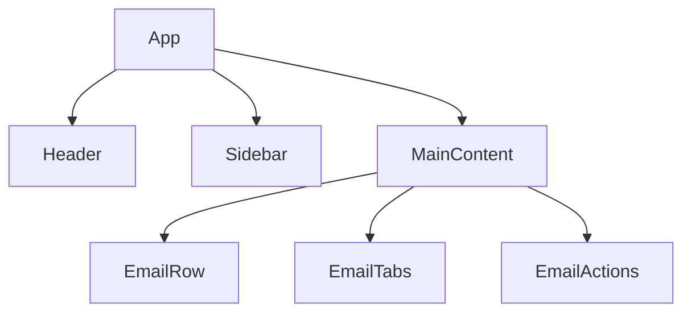
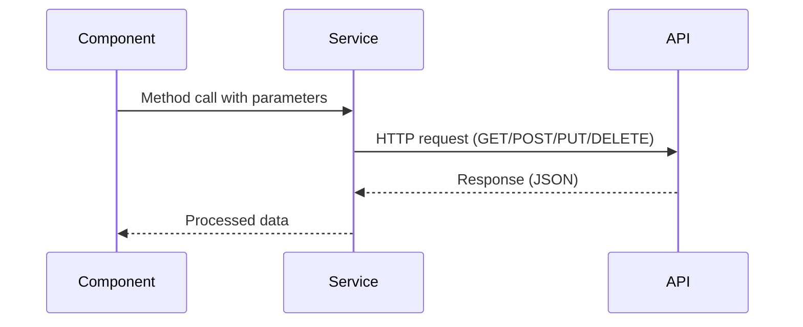
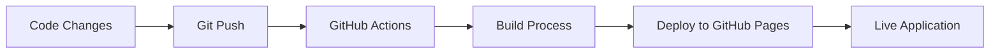

# MailZen Application Architecture

This document provides a comprehensive overview of the MailZen application architecture, including component structure, state management, data flow, backend communication, and deployment processes.

## Component Architecture

MailZen follows a hierarchical component structure with unidirectional data flow. The application is organized into several key components:

### Core Components

- **App**: The root component that manages global state and orchestrates data flow between components.
- **Header**: Contains navigation elements and user profile information.
- **Sidebar**: Provides navigation between different email categories (Inbox, Sent, Draft, etc.).
- **MainContent**: Displays email lists based on the selected category and handles email interactions.
- **EmailRow**: Renders individual email entries with selection capabilities.

### Component Relationships

## State Management

The application follows a top-down state management approach:

1. **App Component State**:
   - `activeTab`: Currently selected email category tab
   - `selectedEmails`: IDs of currently selected emails
   - `selectedSidebarItem`: Currently selected sidebar navigation item
   - Various email collections (inbox, sent, draft, trash, spam)

2. **State Flow**:
   - Parent components pass state and callbacks to child components as props
   - Child components invoke callbacks to communicate state changes to parent components
   - App component serves as the central state manager

3. **Key State Interactions**:
   - Sidebar selection updates the main email view
   - Tab selection filters emails by category
   - Email selection triggers bulk actions availability

## Data Flow

1. User interactions (clicks, selections) trigger event handlers
2. Event handlers execute callbacks that were passed as props
3. These callbacks update state in the App component
4. State changes cause re-rendering of affected components
5. Updated props flow down to child components with new data

## Backend Communication Services

MailZen uses a service-based architecture for backend communication:

### API Services

1. **EmailService**:
   - `fetchEmails()`: Retrieves emails based on filters
   - `sendEmail(email)`: Sends a new email
   - `deleteEmails(ids)`: Moves emails to trash
   - `markAsRead(ids)`: Updates read status of emails
   - `moveToFolder(ids, folder)`: Organizes emails into folders

2. **AuthService**:
   - `login(credentials)`: Authenticates users
   - `logout()`: Ends user session
   - `getCurrentUser()`: Retrieves information about logged-in user
   - `updateProfile(data)`: Updates user profile information

3. **SearchService**:
   - `searchEmails(query)`: Performs text-based search on emails
   - `advancedSearch(criteria)`: Executes searches with multiple filters

### API Communication Pattern

## Deployment Architecture

MailZen is deployed to GitHub Pages through an automated GitHub Actions workflow:

### Deployment Workflow

### Deployment Process Details

1. **Development**:
   - Developers work on feature branches
   - Code reviews via Pull Requests ensure quality

2. **Continuous Integration**:
   - GitHub Actions runs tests on every pull request
   - Linting and type checking maintain code standards

3. **Continuous Deployment**:
   - Merges to the main branch trigger the deployment workflow
   - The workflow:
     - Sets up Node.js environment
     - Installs dependencies
     - Builds the application
     - Deploys build artifacts to GitHub Pages
   - The application is accessible at `https://sushant12.github.io/MailZen`

4. **Configuration**:
   - Base path in `vite.config.ts` ensures correct asset loading
   - Environment variables control API endpoints for different environments

## Performance Considerations

1. **Code Splitting**: Lazy loading components for faster initial load time
2. **Memoization**: React.memo and useMemo to prevent unnecessary re-renders
3. **Virtual Scrolling**: For efficiently rendering large email lists
4. **Service Workers**: For offline capabilities and improved loading performance

## Future Architecture Enhancements

1. **State Management**: Consider Redux or Context API for more complex state requirements
2. **Server-Side Rendering**: Improve initial load performance and SEO
3. **WebSockets**: Real-time updates for new emails
4. **Micro-Frontend Architecture**: For scaling development across teams
