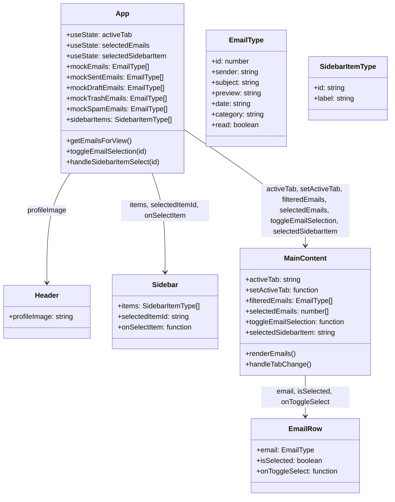

# MailZen Component Structure

This diagram represents the component hierarchy and data flow in the MailZen application.

## Data Flow

1. App component maintains the application state
2. State flows down to child components as props
3. Child components trigger events that update the App state
4. Routes determine what content is displayed in MainContent

## Key State Management

- Email selection state is managed in App and passed to MainContent
- Active category tab state is managed in App
- Selected sidebar item determines which emails are displayed
