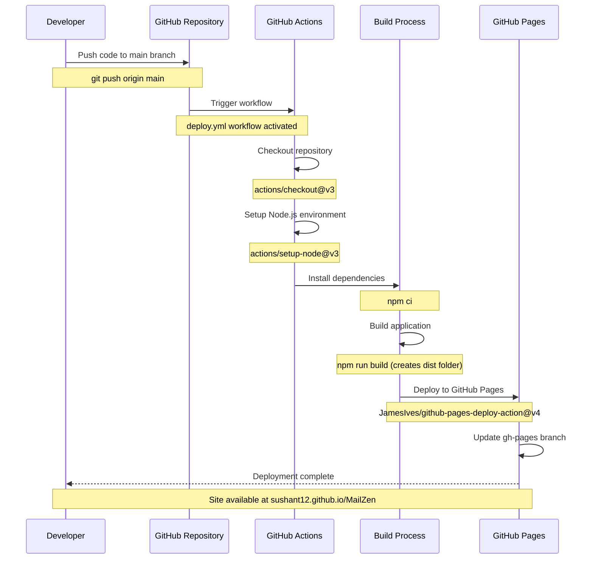

# MailZen Deployment Workflow

This diagram illustrates the sequence of steps in the GitHub Actions deployment process for MailZen to GitHub Pages.

## Deployment Process Explained

1. **Code Push**: Developer commits and pushes code changes to the main branch
2. **Workflow Trigger**: The push event triggers the GitHub Actions workflow defined in `.github/workflows/deploy.yml`
3. **Environment Setup**: The workflow sets up the necessary environment:
   - Checks out the code
   - Sets up Node.js with the specified version
   - Configures npm caching for faster builds
4. **Build Process**:
   - Installs project dependencies with `npm ci` (clean install)
   - Builds the React application with `npm run build`
   - The build output is generated in the `dist` directory
5. **Deployment**:
   - The GitHub Pages deployment action takes the build artifacts from the `dist` directory
   - Pushes them to the `gh-pages` branch
   - GitHub Pages serves the content from this branch
6. **Accessibility**:
   - The deployed application becomes available at `https://sushant12.github.io/MailZen`
   - The base path in `vite.config.ts` ensures all assets are loaded correctly

## Prerequisites

- GitHub repository with GitHub Pages enabled
- Repository permissions configured to allow GitHub Actions to write to the repository
- Proper configuration in `vite.config.ts` to handle the base path for GitHub Pages
